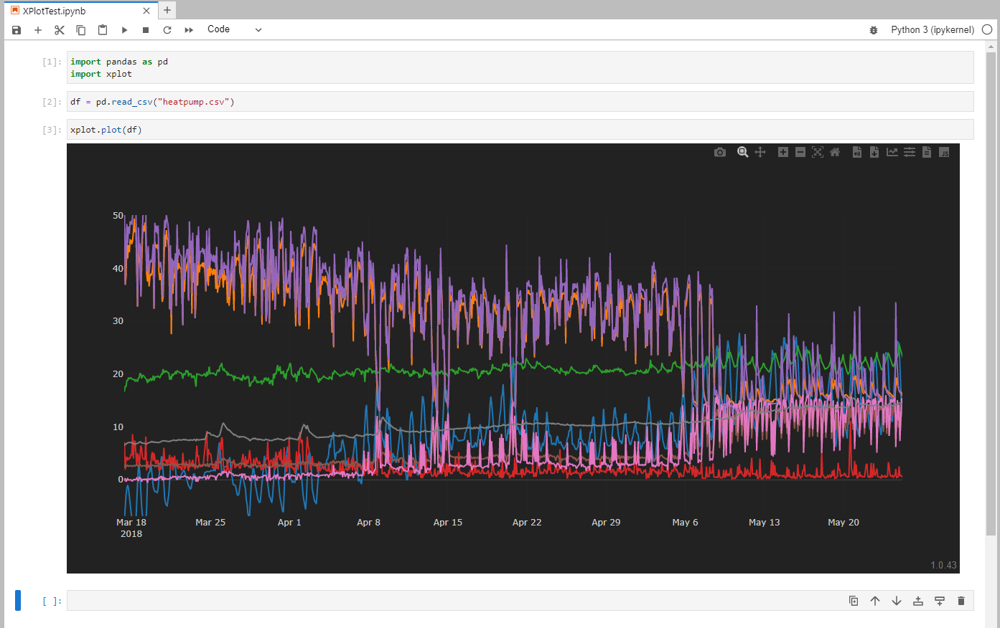

# py-plot

Python library for plotting using XPlot in Jupyter notebooks.

**Features**

- interactive plotting
- export/share plots
- view plots anywhere
- Web app (PWA) at https://xplot.app

## Installing

## How to build

```
python setup.py build
```

### Prepare for PyPi
```
python setup.py sdist bdist_wheel
python -m twine upload dist/*
```

## How to install

**Install using pip**

```
pip install xplot
```

**Install from this repo**

```
python -m pip install .
```

**Install from GitHub repo**

```
python -m pip install git+https://github.com/izaxon/py-plot.git
```

## Use in a Jupyter Notebook

```python
import pandas as pd
import xplot

df = pd.read_csv("data.csv")
xplot.plot(df)
```


